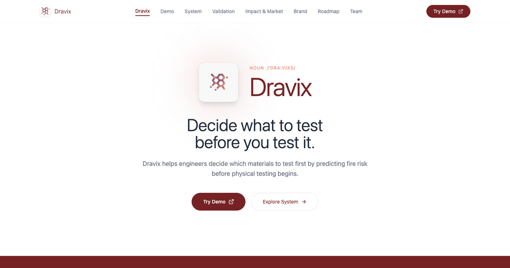
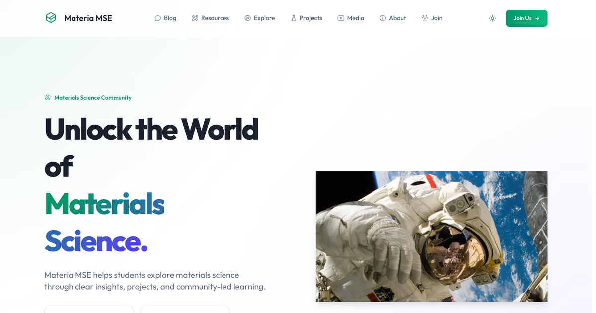
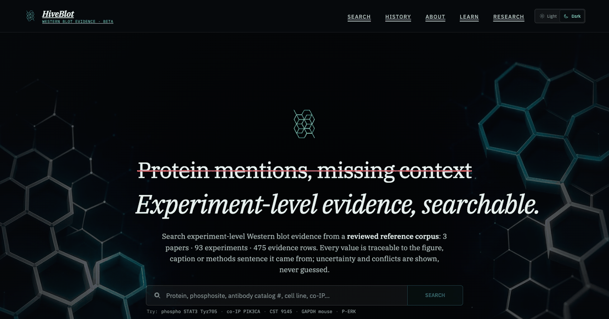
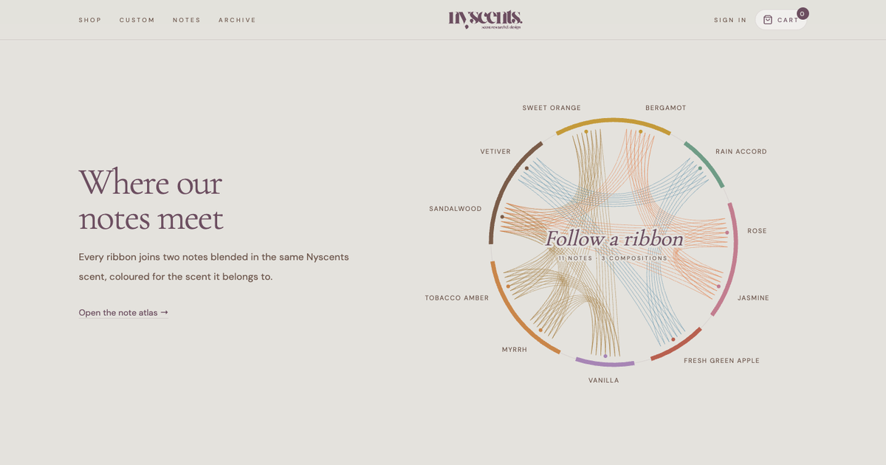
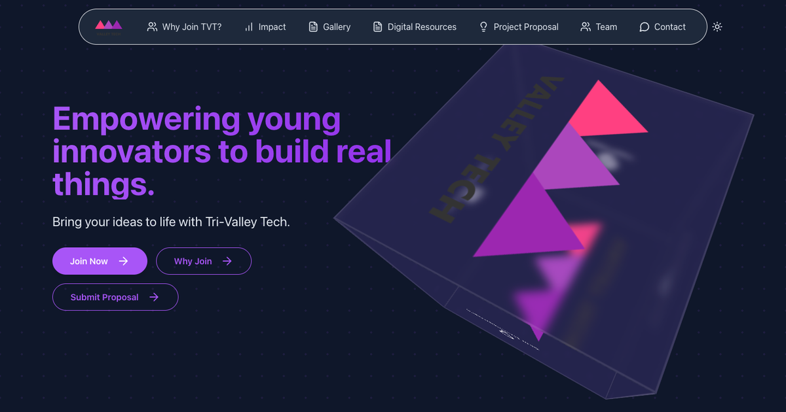
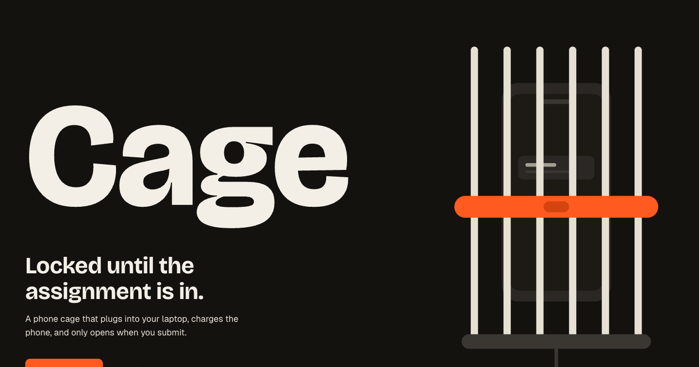

# Nikhilesh Suravarjjala

I design and build websites, research tools, and brands.

<table>
  <tr>
    <td width="50%" valign="top"> <b>Dravix</b> Machine-learning screening that ranks materials by fire risk before physical testing. <a href="https://dravix.materiamse.com">Site</a> · <a href="https://dravix-engine.materiamse.com">Engine</a></td>
    <td width="50%" valign="top"> <b>Materia MSE</b> A materials science hub for students, with explainers, interactive tools and projects.</td>
  </tr>
  <tr>
    <td width="50%" valign="top"> <b>HiveBlot</b> Search engine for experiment-level Western blot evidence, traced back to the source figure.</td>
    <td width="50%" valign="top"> <b>NYSCENTS</b> A small fragrance studio: brand identity, storefront and a scent note atlas. <a href="https://nyscents.nikhileshsuravarjjala.com">Site</a> · <a href="https://memory2scent.nikhileshsuravarjjala.com">Memory2Scent</a>, a small neural network that turns a childhood memory into a fragrance concept</td>
  </tr>
  <tr>
    <td width="50%" valign="top"> <b>Tri-Valley Tech</b> Website for a student-run nonprofit where high schoolers build tech projects.</td>
    <td width="50%" valign="top"> <b>Cage</b> A phone cage that stays locked until your assignment is submitted.</td>
  </tr>
</table>

**Also:** [SpeakersCircle](https://www.speakerscircle.org) · [Financial Folks](https://www.financial-folks.com) · [National Letters](https://letters.neurohealthalliance.org) · [VOC-Triage](https://voc-t-design-1.vercel.app) · [Music](https://nikhilesh-music.vercel.app)
